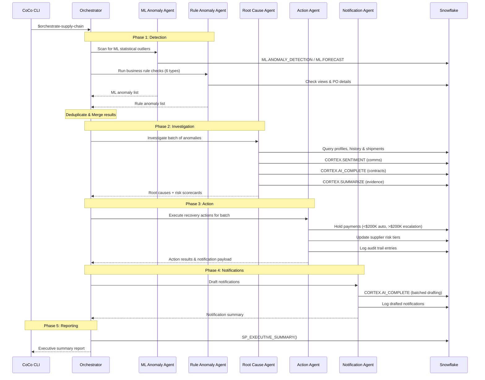
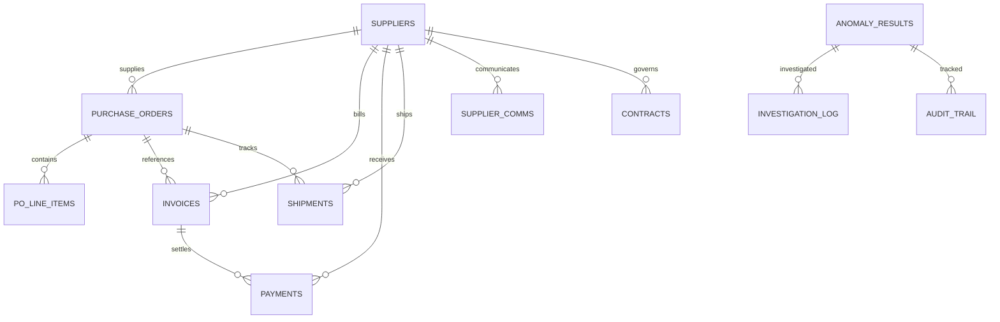

# Architecture — LedgerLink

## System Overview

The LedgerLink is a multi-agent AI system built on Snowflake CoCo CLI
that autonomously detects, investigates, and resolves supply chain financial anomalies.

## Architecture Diagram

```mermaid
graph TB
    subgraph "User Interface"
        CLI["CoCo CLI Terminal"]
    end

    subgraph "Orchestration Layer"
        ORCH["Master Orchestrator<br/>$orchestrate-supply-chain"]
    end

    subgraph "Agent Skills (Detection)"
        S1a["ML Anomaly Agent<br/>$ml-anomaly-agent"]
        S1b["Rule Anomaly Agent<br/>$rule-anomaly-agent"]
    end

    subgraph "Agent Skills (Investigation & Action)"
        S2["Root Cause Agent<br/>$root-cause-agent"]
        S3["Action Agent<br/>$action-agent"]
        S4["Notification Agent<br/>$notification-agent"]
    end

    subgraph "Snowflake AI/ML Engine"
        AD["ML.ANOMALY_DETECTION"]
        FC["ML.FORECAST"]
        AIC["CORTEX.AI_COMPLETE"]
        SENT["CORTEX.SENTIMENT"]
        SUM["CORTEX.SUMMARIZE"]
    end

    subgraph "Data Layer (4 Schemas)"
        subgraph "CORE"
            SUP["Suppliers"]
            PO["Purchase Orders"]
            LI["PO Line Items"]
            INV["Invoices"]
            PAY["Payments"]
            SHP["Shipments"]
        end
        subgraph "UNSTRUCTURED"
            COM["Supplier Comms"]
            CON["Contracts"]
        end
        subgraph "ANALYTICS"
            ANO["Anomaly Results"]
            ILG["Investigation Log"]
            RSC["Risk Scorecards"]
        end
        subgraph "AUDIT"
            AUD["Audit Trail"]
            NLG["Notification Log"]
        end
    end

    CLI --> ORCH
    ORCH -->|Phase 1a| S1a
    ORCH -->|Phase 1b| S1b
    ORCH -->|Phase 2| S2
    ORCH -->|Phase 3| S3
    ORCH -->|Phase 4| S4

    S1a --> AD & FC
    S2 --> AIC & SENT & SUM
    S3 --> AUD
    S4 --> AIC

    S1a & S1b --> INV & PAY & PO
    S2 --> SUP & SHP & COM & CON
    S3 & S4 --> AUD & NLG

    S1a & S1b -->|writes| ANO
    S2 -->|writes| ILG
    S3 -->|writes| AUD
    S4 -->|writes| NLG
```

## Data Flow

## Technology Stack

| Layer | Technology | Purpose |
|:---|:---|:---|
| Interface | Snowflake CoCo CLI | Natural language interaction, skill execution |
| Orchestration | CoCo Custom Skills (6) | Workflow chaining, decision routing |
| ML Engine | Snowflake ML Functions | Anomaly detection, forecasting |
| AI Engine | Snowflake Cortex AI | Text analysis, reasoning, summarization |
| Data Store | Snowflake (4 schemas) | 11 tables, 10+ views, 5 procedures |
| Monitoring | Snowflake Streams + Tasks | Real-time change detection, scheduled scans |
| Audit | Snowflake Tables | Immutable action trail |

## Schema Relationships

